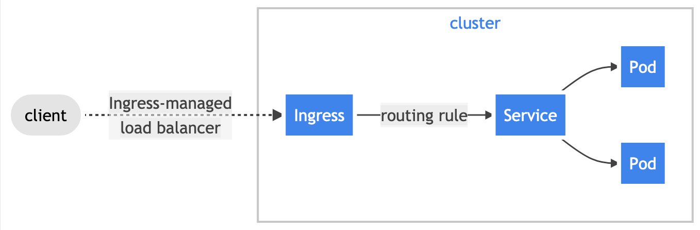

# Kubernetes internal training

---
## 1. Main K8s Components
Youtube : https://www.youtube.com/watch?v=X48VuDVv0do&t=320s

Duration : 17'

- Nodes

- Pods
- Services
- Ingress


- ConfigMap
- Secrets


- Volumes
- Deployment (ReplicaSet)


- StatefulSet
- DaemonSet

Also nice simple (and fun) introduction : https://medium.com/@geraldcroes/kubernetes-traefik-101-when-simplicity-matters-957eeede2cf8


## 2. K8s Architecture
Youtube : https://www.youtube.com/watch?v=X48VuDVv0do&t=1349s

Duration : 12'


## 3. Kind and kubectl - Hands-on environment Setup

We need `kind` installed.

Prepare locally a cluster (named `training`) by running:

```
cd kind-helper
./k8s-create.sh
```

(alternative explanations : https://prefetch.net/blog/2019/10/07/creating-multi-node-kubernetes-test-clusters-with-kind-kubernetes-in-docker/)

Verify we have 3 nodes by running the proper command.

Cluster info could also be retrieved by

```
kubectl cluster-info

#full details (huge output)
kubectl cluster-info dump
```

But we don't need it as we already have a docker-desktop cluster (and Istio managing network for all clusters).

So, delete the cluster by :

    kind delete cluster --name kind-training
    kubectl config delete-cluster kind-training
    kubectl config delete-context kind-training

<br />

### 3.1 Prerequisites

Have locally :
- run setup_kubernetes_for_dev latest version
- istioingress-gateway pod up and running
- a reporting / oncoportal service properly deployed (skaffold)


## 4. Main Kubectl Commands - K8s CLI

### 4.1 Config file

What in it ? 

```
cat ~/.kube/config
```

list of clusters with
 - certificate
 - server url
 - name

List of contexts :
- maping 1 cluster / 1 user

List of users with :
- name
- certificate
- key
- token

--> necessary to connect remotely to a cluster


<br />

### 4.2 Persistent working contexts

Switch context

    kubectl config get-contexts
    kubectl config use-context <context>

Switch namespace
Install kubens (`brew install kubectx`)

    kubens <namespace>


<br />

### 4.3 Common parameters

Labels --> what for

Node affinity --> what for


<br />

### 4.4 Get official API description
    
    kubectl explain <pod|daemonset|service|...>

<br />

### 4.5 Common fonctions

```
kubectl get all
kubectl get <type>
kubectl get <what> <which_one> -o wide
kubectl get <what> <which_one> -o yaml|json
kubectl get <what> <which_one> -o=jsonpath='{.items[0].metadata.name}'
```

Debugging
```
kubectl describe <what> <which_one>
kubectl logs <what> <which_one>
```

Use -w to watch changes live.

<br />

### 4.6 Create items

    kubectl create -h

**Important** : Can't create pod because smallest unit in k8s managed at higher level, usually Deployment.

Create a deployment, a replicaset, a pod, ...

    kubectl create deployment <deployment_name> --image=<image_name>

- each item will be named after its parent
- each item can be created with some specific parameters

Each **create** command generates a .yaml file to describe the item configuration.

As parameters are specific, it's easiest to write directly yaml files.

- for deployments : https://kubernetes.io/docs/concepts/workloads/controllers/deployment/
- for Services : https://kubernetes.io/docs/concepts/services-networking/service/
- ...

then create the item by 
```
kubectl apply -f the_file.yaml
```


**Hands-on**
<Exercice>__________________________________________________________

    Create a whoami deployment with 1 replica
    Deployment name : whoami-deployment
    Docker image : containous/whoami
    Expose port 80

</Exercice>__________________________________________________________________


Then, by modifying the yaml file, we can:
- update the item
```
kubectl apply -f the_file.yaml
```

**Hands-on**
<Exercice>__________________________________________________________

    Change the number of replica to 2 
    apply and observe

</Exercice>__________________________________________________________________


- delete the item
```
# using the yaml file
kubectl delete -f the_file.yaml

# using the item kind and name
kubectl delete <what> <which_one>
```

<br />

Or directly edit the yaml file and apply the changes :

    kubectl edit <what> <which_one> 

Will :
- open yaml file in default editor for kubectl
- save and close
- auto apply changes

How to change default editor ?

export KUBE_EDITOR="/Applications/Sublime\ Text.app/Contents/SharedSupport/bin/subl"


<br />

## 5. K8s Services explained

Abstraction on top of pods because pods are volatile, so are their IPs. Pattern usually called ... a micro-service !

Services should always rely on app selectors (labels).
If not, its' for specific goals (https://kubernetes.io/docs/concepts/services-networking/service/#services-without-selectors).

**Liveness**: if fails, pod restarted

**Readyness** : if fails, put out of traffic then back when ok
--> implementation should check the capacity of the service to answer requests

Different kind of services :

- clusterIP : service only reachable from within the cluster
- NodePort : expose service on static `<node IP>:<dynamic_node_port>` where node port in 30000-32767 by default
- LoadBalancer : expose service using a cloud load balancer

<br />

## 6. K8s Ingress / Ingress controller explained

Ingress exposes HTTP and HTTPS routes from outside the cluster to services within the cluster. Traffic routing is controlled by rules defined on the Ingress resource.



You must have an Ingress controller to satisfy an Ingress. Only creating an Ingress resource has no effect.

Ingress rules will act as a reverse proxy, routing incoming traffic to cluter services based on URI rules.

An ingress can be secured : https://kubernetes.io/docs/concepts/services-networking/ingress/#tls


<br />


## 7. Simple demo - whoami

**Goal** : deploy a simple whoami service and get access to it

**Hands-on**
<Exercice>__________________________________________________________

    Step 1
        make sure we have 2 whoami pods running 

    Step 2
        create a service :
          - name : whoami-service
          - map port 80 to 80

    Step 3:
        We should create an ingress item (see example/simple-service/whoami-ingress.yaml) but istio is an ingress controller taking care of everything
        So we need to create an Istio item which is a virtual service
        apply example/simple-service/whoami-virtualservice.yaml

    Step 4: 
        access by http://dev.sophiagenetics.com/bench --> should return 1
    
    Step 5: 
        access by http://dev.sophiagenetics.com/ --> should return HTTP request details

    Step 6: 
        connect in SSH to your reporting / oncoportal pod and curl the same end points using 
        <servicename>.<namespacename>.svc.cluster.local

</Exercice>__________________________________________________________________


## 8. Demo Project: MongoDB and MongoExpress

**Goal** : deploy a MongoDB and Mongo Express, web front-end to manage it.

Youtube: https://www.youtube.com/watch?v=X48VuDVv0do&t=4576s

Duration : 30min

All files in example/mongo-setup 

**Hands-on**
<Exercice>__________________________________________________________

    Step 1
        create deployment for MongoDB without settings secret
        create secret to store username / password to get access to the database
        add the references in DB deployment file
        apply it
    
    Step 2
        create service for MongoDB
    
    Step 3
        create deployment for express without DB url
        create configMap to store this DB url (could be injected in prod with something else)
        add the reference in DB deployment file
        apply it
    
    Step 4
        create service for Mongo Express
    
    Step 5
        Should have been to modify service to expose it with the help of an ingress / ingress controller
        Here, just have to create a virtual service to route / to / on the right port
        Verify it works : https://dev.sophiagenetics.com/

</Exercice>__________________________________________________________________


<br />

## 9. Organizing your components with K8s Namespaces

<br />

## 1. Persisting Data in K8s with Volumes

<br />

## 1. DaemonSet usage

<br />

## 1. Deploying Stateful Apps with StatefulSet

<br />

## 1. Helm - Package Manager


